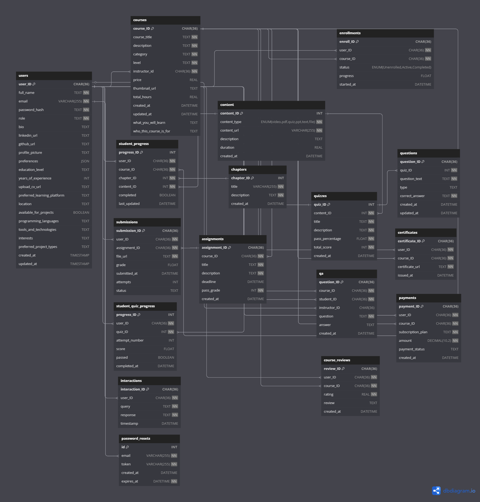

# Course DataBase - MySQL Setup for Personalized Education Platform

## Overview

This project uses a MySQL database to store and manage educational content, user progress, courses, quizzes, assignments, and interactions for a personalized learning platform. It integrates with a **ReactJS** frontend and **NodeJS** backend. The platform allows users to track their progress, interact with an AI chatbot, and receive personalized learning recommendations.

This README will focus on the **MySQL Database setup**, along with connection details for your Node.js application.

## Technologies Used

- **Backend**: Node.js (Express)
- **Frontend**: ReactJS
- **Database**: MySQL
- **Authentication**: JWT-based authentication (assumed in backend)
- **AI**: AI-powered chatbot (integrated with backend)

## Database Configuration

The MySQL database is hosted remotely using Amazon RDS, and the following credentials are used to establish the connection:

### Connection Details

- **Host**: `db.cl0oa2kwiw65.me-central-1.rds.amazonaws.com`
- **User**: `admin`
- **Password**: `bo13QknuzQ5nKR95QU9i`
- **Database Name**: `CourseDataBase`

## Features

- **Personalized Learning**: Recommends courses, quizzes, and projects based on user preferences, skills, and learning history.
- **Interactive Chatbot**: AI-driven chatbot to assist users with queries about courses, assignments, and their progress.
- **Progress Tracking**: Track course progress, assignments, quizzes, and track user engagement.
- **Admin & Instructor Roles**: Allow instructors to create and manage courses, quizzes, and assignments, while admins manage users.
- **Course & Assignment Management**: Includes features for enrolling users, managing content, and grading assignments.

## Database Schema

The following is the database schema used in this project to store user, course, progress, and interaction data:

### 1. **Users Table**
Stores user information, authentication details, and preferences.
- **`user_ID`**: Unique User ID
- **`full_name`**: User's full name
- **`email`**: User's email (unique)
- **`pw_hash`**: Hashed password
- **`role`**: Role of the user (`Student`, `Admin`, `Instructor`)
- **`bio`**: Short user bio
- **`linkedin_url`**, **`github_url`**: LinkedIn and GitHub URLs
- **`profile_picture`**: Optional profile picture URL
- **`preferences`**: User preferences (language, theme, etc.)
- **`education_level`**: Education background
- **`years_of_experience`**: Professional experience
- **`upload_cv_url`**: URL to the user’s CV
- **`preferred_learning_platform`**: Preferred platform for learning
- **`location`**: User’s current location
- **`available_for_projects`**: Whether the user is open to projects
- **`programming_languages`**, **`tools_and_technologies`**: Skills
- **`interests`**, **`certifications`**, **`preferred_project_types`**: Professional interests and certifications

### 2. **Courses Table**
Stores details about available courses.
- **`course_ID`**: Unique Course ID
- **`course_title`**: Course title
- **`description`**: Course description
- **`level`**: Difficulty level (`Beginner`, `Intermediate`, `Advanced`)
- **`category`**: Course category (e.g., AI, Data Science)
- **`instructor_ID`**: Links to the instructor (user)
- **`price`**: Course price
- **`thumbnail_url`**: Thumbnail image for the course
- **`total_hours`**: Total course duration in hours
- **`what_you_will_learn`**, **`who_this_course_is_for`**: Learning objectives

### 3. **Chapters Table**
Stores chapters for each course.
- **`chapter_ID`**: Unique Chapter ID
- **`course_ID`**: Links to the related course
- **`title`**: Chapter title
- **`description`**: Chapter description

### 4. **Content Table**
Stores the content for each course (videos, PDFs, quizzes, etc.).
- **`content_ID`**: Unique Content ID
- **`content_type`**: Type of content (video, pdf, quiz, etc.)
- **`content_url`**: URL for the content
- **`duration`**: Duration (for videos)

### 5. **Student Progress Table**
Tracks student progress within each course.
- **`progress_ID`**: Unique Progress ID
- **`user_ID`**: User ID
- **`course_ID`**: Course ID
- **`chapter_ID`**: Chapter ID
- **`content_ID`**: Content ID
- **`completed`**: Whether the student has completed the lesson
- **`last_updated`**: Last update timestamp

### 6. **Enrollments Table**
Tracks which users are enrolled in which courses.
- **`enroll_ID`**: Unique Enrollment ID
- **`user_ID`**: User ID
- **`course_ID`**: Course ID
- **`status`**: Enrollment status (`Unpaid`, `Active`, `Completed`)
- **`progress`**: Progress percentage (0-100%)

### 7. **Quizzes Table**
Stores quiz details.
- **`quiz_ID`**: Unique Quiz ID
- **`content_ID`**: Content ID for linking quiz
- **`title`**: Quiz title
- **`pass_percentage`**: Percentage required to pass
- **`total_score`**: Total score of the quiz

### 8. **Questions Table**
Stores quiz questions.
- **`question_ID`**: Unique Question ID
- **`quiz_ID`**: Links to the related quiz
- **`question_text`**: Question content
- **`type`**: Question type (`MCQ`, `Short Answer`, etc.)
- **`correct_answer`**: Correct answer

### 9. **Student Quiz Progress Table**
Tracks student quiz attempts.
- **`progress_ID`**: Unique Progress ID
- **`user_ID`**: User ID
- **`quiz_ID`**: Quiz ID
- **`attempt_number`**: Quiz attempt number
- **`score`**: Quiz score
- **`passed`**: Whether the student passed or failed

### 10. **Assignments Table**
Stores assignments for each course.
- **`assignment_ID`**: Unique Assignment ID
- **`course_ID`**: Course ID
- **`title`**: Assignment title
- **`description`**: Assignment instructions
- **`deadline`**: Submission deadline

### 11. **Submissions Table**
Tracks student assignment submissions.
- **`submission_ID`**: Unique Submission ID
- **`user_ID`**: User ID
- **`assignment_ID`**: Assignment ID
- **`file_URL`**: URL to the assignment submission
- **`grade`**: Grade given by the instructor

### 12. **QA Table**
Stores student-instructor discussions.
- **`question_ID`**: Unique QA ID
- **`course_ID`**: Course ID
- **`user_ID`**: Student ID
- **`instructor_ID`**: Instructor ID
- **`question`**: Question asked by the student
- **`answer`**: Instructor's answer

### 13. **Chatbot Interactions Table**
Stores chatbot interactions.
- **`interaction_ID`**: Unique Interaction ID
- **`user_ID`**: User ID
- **`query`**: User query to the chatbot
- **`response`**: AI-generated response
- **`TIMESTAMP`**: Timestamp of the interaction

### 14. **Database Schema**

## Setup Instructions

### Prerequisites

- Python 3.8+
- PostgreSQL (via Supabase or locally)
- Streamlit, FastAPI, Supabase client libraries