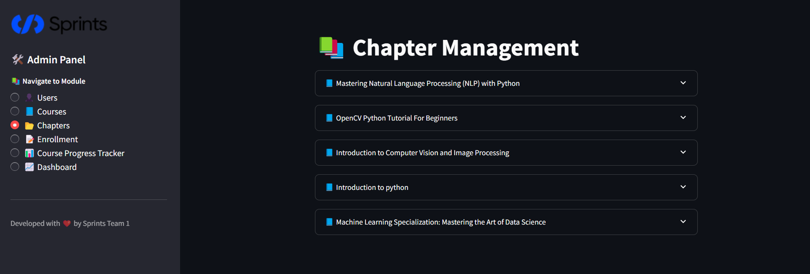

# 📚 Sprints Admin Panel

Welcome to the **Sprints Admin Panel**, a powerful and user-friendly web interface for managing users, courses, chapters, enrollment, and tracking student progress in a structured educational system.

---

## 🚀 Features

- 👤 **User Management**: View, add, edit, and manage user details.
- 📘 **Course Management**: Full CRUD operations for courses.
- 📂 **Chapter Management**: Add, edit, and view course chapters.
- 📝 **Student Enrollment**: Handle student enrollments per course.
- 📊 **Course Progress Tracker**: Track students' progress throughout the course.
- 📈 **Dashboard**: Visualize student progress and insights.

---

## 🧰 Tech Stack

- **Python 3.8+**
- **Streamlit**
- **MySQL**
- Modular structure for scalability and maintainability

---

## 🖼️ Screenshots


---

## 🛠️ Setup Instructions

1. **Clone the repository**

```bash
git https://github.com/AbanoubYounan/Sprinter-Education-Platform.git
cd admin_portal
```

2. **Create virtual environment (optional but recommended)**

```bash
python -m venv venv
source venv/bin/activate  # On Windows: venv\Scripts\activate
```

3. **Install dependencies**

```bash
pip install -r requirements.txt
```

4. **Set up your MySQL database** and update the connection in `db_connection.py`.

5. **Run the application**

```bash
streamlit run main.py
```

---

## 🧱 Project Structure

```
├── assets/
│   └── sprints_logo.png
|   └── Users_Page
|   └── Courses_Page
|   └── Chapters_Page
|   └── Enrollment_Page
|   └── Course_Progress_Tracker
|   └── Dashboard_Page
|
├── app.py
├── db_connection.py
├── user_modules/
├── course_modules/
├── chapter_modules/
├── content_modules/
├── student_progress_module/
├── student_enrollment_module/
├── Course_Progress_Tracker_module/
└── requirements.txt
```

---

## 👨‍💻 Developer
** Sprints Team One**
---
## 📄 License
MIT License. See `LICENSE` file for more information.

---
## 👤 Home Page Schreenshoots and demo


 
 
 
 
---
## 📘 Courses Page Schreenshoots and demo


 
 
 
 

---
## 📂 Chapters Page Schreenshoots and demo



 
 
 
 
 
---
## 📝 Enrollment Page Schreenshoots and demo


 
 
 
 
 

---
## 📊 Course Progress Tracker Page Schreenshoots and demo


 

---
## 📈 Dashboard Page Schreenshoots and demo


 

 